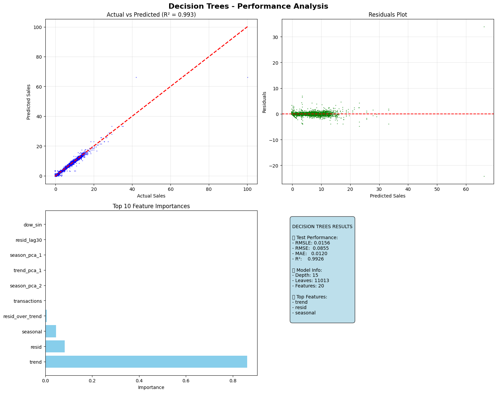
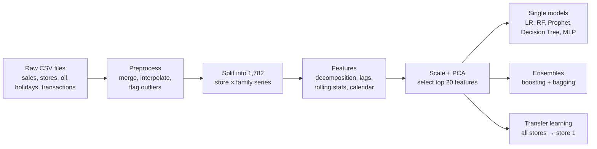
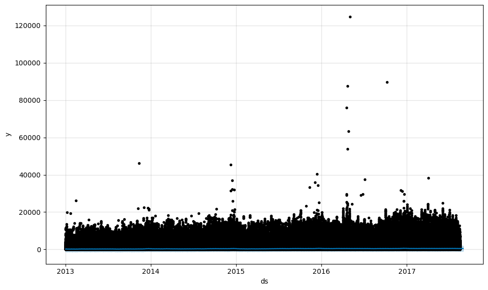
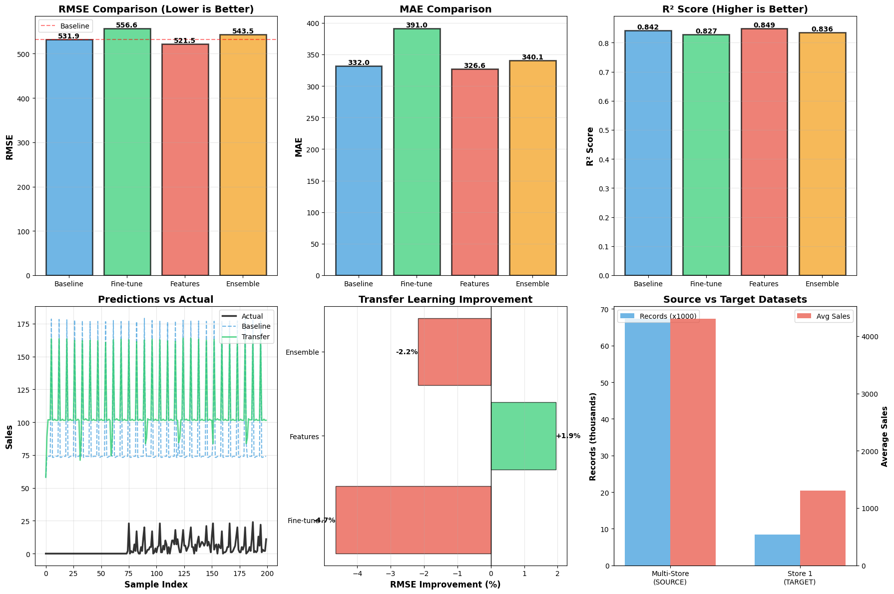

# Multivariate Retail Demand Forecasting


How many groceries will each store sell in the next 15 days? This project builds time-series features for
**1,782 store × product-family series** of the Favorita supermarket chain (Ecuador) and compares single models,
boosting and bagging ensembles, and transfer learning for predicting daily sales.



## At a glance

| | |
|---|---|
| **Data** | 3M+ daily sales records · 54 stores · 33 product families · Jan 2013 – Aug 2017 |
| **Goal** | predict daily sales per store and product family 15 days ahead, scored with RMSLE |
| **Features** | seasonal-trend decomposition, lags (1–90 days), rolling statistics, calendar, payday and earthquake features, PCA |
| **Models** | Linear Regression, Random Forest, Prophet, Decision Tree, Neural Network (MLP) |
| **Ensembles** | AdaBoost, Gradient Boosting, Random Forest, Extra Trees, Bagging, hybrid average |
| **Context** | NTNU course IT3212, Autumn 2025, group project |

## Pipeline



## Results

### Single models (Tasks 5–6)

| Model | RMSLE | R² |
|---|---|---|
| Linear Regression | 0.0119 | 0.998 |
| Random Forest | 0.0043 | 0.999 |
| Prophet (true 15-day forecast) | 3.9237 | 0.012 |
| Decision Tree (tuned with GridSearchCV) | 0.0156 | 0.993 |
| Neural Network (MLP, 100–50 units) | 0.0083 | 0.999 |

The near-perfect scores are **not** real forecasting accuracy; see the notes below. The Decision Tree's feature
importance (chart above) shows why: it relies almost entirely on `trend`, which is computed from the same day's sales.

### Prophet: 15-day forecast



### Transfer learning (Task 8)

A Random Forest trained on many stores is reused for store 1. Using the multi-store model's predictions as an extra
feature ("feature extraction") gave the best result: R² 0.849 vs. 0.842 for a store-1-only model (RMSE −1.9 %).



## Notes and known issues

This repository contains the notebook **as the team submitted it**, with its original outputs. Read the scores as a
comparison between models, not as real forecasting accuracy:

- **Target leakage:** some input features (the trend, seasonal and residual parts of the decomposition, and rolling
  windows that include the current day) are computed from the same day's sales, so the models can partly
  reconstruct the answer. That is why R² is close to 1.
- **Random split:** most models are evaluated on a random 80/20 split of rows rather than on the last 15 days.
- **Scaled target:** sales are standardized before modelling, so RMSE and MAE are in standard-deviation units.
- **Random Forest** was scored on its own training data, which flatters its result.
- **Boosting and bagging (Task 7):** the Prophet step reloads the raw sales into the same variable that held the
  engineered features, so the ensembles in the saved output were trained on a single raw column and score far
  worse than the single models. The fix is to keep the raw data in a separate variable; a corrected re-run is in
  progress and will replace this version.
- The notebook was assembled from several team members' sessions, so running it top to bottom needs small path
  changes (the data paths point to `./store-sales-item-time-series/`).

## Repository structure

```
├── retail_demand_forecasting.ipynb   # full pipeline with the submitted outputs
├── images/                           # figures used in this README
├── requirements.txt
└── data/                             # dataset goes here (not included, see below)
```

> If GitHub doesn't display the notebook, open it on
> [nbviewer](https://nbviewer.org/github/EbrahimShirjazi/Multivariate-Retail-Demand-Forecasting/blob/main/retail_demand_forecasting.ipynb).

## Data

Download the CSV files from the Kaggle competition
[Store Sales – Time Series Forecasting](https://www.kaggle.com/competitions/store-sales-time-series-forecasting/data)
and install the packages with `pip install -r requirements.txt`.

## Team and my contributions

Group project in the NTNU course IT3212 (Autumn 2025) with [@luchs007](https://github.com/luchs007),
[@SaraSopr](https://github.com/SaraSopr) and [@pariaznd](https://github.com/pariaznd).

| Part | By |
|---|---|
| Problem definition, preprocessing, feature engineering | @luchs007 |
| Feature selection, Linear Regression, Random Forest, Prophet | @SaraSopr |
| **Decision Tree with GridSearchCV, Neural Network (MLP), five-model comparison** | **me** |
| **Boosting and bagging ensembles** | **me** |
| Transfer learning | @pariaznd |
